# Exercícios Docker
Este repositório contém os comandos e prints necessários para evidenciar a execução da lista de exercícios propostos com Docker.
---
### 1. Olá, Docker!

Criei um arquivo `Dockerfile` usando a imagem **alpine** como base para imprimir "Olá, Docker!". Em seguida, construí a imagem com o nome `meu-echo` e executei um container a partir dela.

**Dockerfile:**

```dockerfile
#Dockerfile
FROM alpine:3.21.3
CMD echo "Olá, Docker!"
```

**Resultado:**
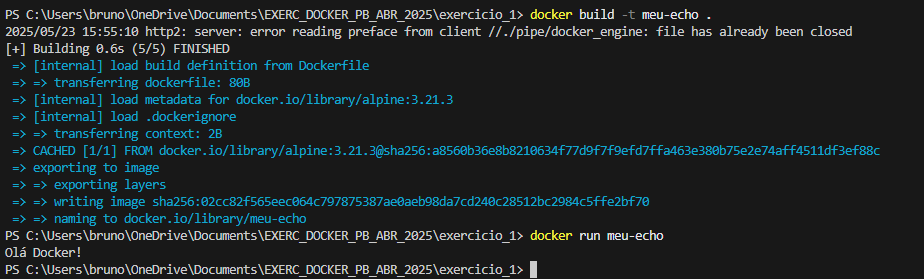

---
### 2. Nginx com Página Customizada 

Configurei um container Nginx para servir uma página HTML customizada (index.html). Montei um volume local para garantir que o arquivo aparecesse na raiz do site (/usr/share/nginx/html). Acessível via http://localhost.

### 2.1 
A primeira parte foi fazer uma página `HTML` customizada! Este arquivo substituirá a página padrão `Welcome to Nginx!`.

**Estrutura HTML**

```html
<!DOCTYPE html>
<html lang="en">
<head>
    <meta charset="UTF-8">
    <meta name="viewport" content="width=device-width, initial-scale=1.0">
    <title>Bem-vindo ao Nginx com Docker!</title>
    <style>
        body { font-family: Arial, sans-serif; text-align: center; margin-top: 50px; background-color: #f0f0f0; }
        h1 { color: #333; }
        p { color: #666; }
       .container { background-color: #fff; padding: 30px; border-radius: 8px; box-shadow: 0 4px 8px rgba(0,0,0,0.1); display: inline-block; }
    </style>
</head>
<body>
    <div class="container">
        <h1>Esse é um Contêiner Nginx Customizado!</h1>
        <p>Esta página está sendo servida por um Nginx rodando em Docker, com conteúdo montado via volume.</p>
        <p>Acesso via <code>http://localhost</code></p>
    </div>
</body>
</html>
```
Este arquivo ``index.html`` será montado na raiz web padrão do contêiner Nginx, efetivamente substituindo o conteúdo padrão original do contêiner.

## 2.2  Criando o Dockerfile
Criei um ``Dockerfile`` na mesma pasta do ``index.html`` e adicionei o seguinte conteúdo a ele:

```Dockerfile
FROM nginx:1.27.5
COPY index.html /usr/share/nginx/html/index.html
```
Explicação:

* ``FROM nginx:1.27.5``: Esta linha instrui o Docker a usar a imagem oficial do Nginx como base para a sua nova imagem.

* ``COPY index.html /usr/share/nginx/html/index.html``: Esta linha copia o seu arquivo index.html (que está no mesmo diretório do Dockerfile) para o diretório /usr/share/nginx/html dentro da imagem Docker. Este é o local padrão onde o Nginx procura por arquivos HTML para servir.   

## 2.3 Montando a imagem

* Para montar a imagem usei a linha de comando:
```Bash
docker build -t meu-nginx-customizado .
```

* Após isso, conferi no terminal se o arquivo ``index.html`` tinha sido movido para a pasta correta.

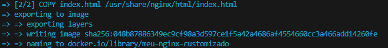

## 2.4 Executando o contêiner

* Para executar o contêiner utilizei a linha de comando:
```
docker run -d --name meu-nginx-web -p 80:80 meu-nginx-customizado
```
* ``-d`` para o processo rodar em segundo plano e eu continuar tendo acesso ao meu terminal.
* ``--name`` para dar um nome ao ao meu contêiner.
* ``-p`` para mapear as portas do host/contêiner, feito na porta 80 para ter acesso pelo http://localhost .

## Processo feito, foi só entrar no navegador e ver o resultado:
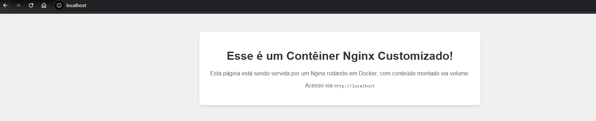

---

### 3. Iniciar um container da imagem ubuntu com um terminal interativo (bash). Navegue pelo sistema de arquivos e instale o pacote curl utilizando apt.

## 3.1 iniciando o Ubunto interativo:
* A primeira coisa é utilizar o seguinte comando no terminal:
```bash
docker run -it ubuntu bash
```
* ``-it`` é uma combinação de duas flags:
    * ``-i``(interactive) Mantém o STDIN aberto mesmo se não estiver anexado.
    * ``-t``(tty) Aloca um pseudo-TTY. O que permite ter uma experiência de um terminal iterativo.

* ``Ubuntu`` : É a imagem que o docker vai usar nesse caso.
* ``bash``: É o comando que será executado dentro do container assim que ele iniciar, isso faz abrir um terminal bash  dentro do container.

Após a execução do comando o ``prompt de comando`` ficou assim:

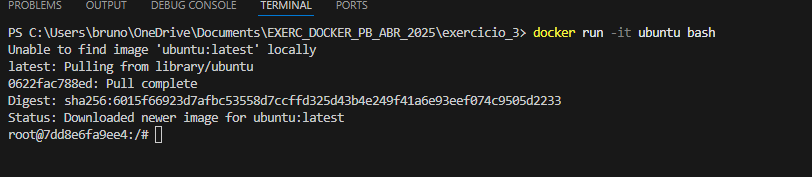

A linha final escrita ``root@7dd8e6fa9ee4:/#`` indica que já estamos dentro do terminal do container ``Ubuntu``.

## 3.2 - instalando o pacote curl
Antes de instalar qualquer pacote com o comando ``apt``, a boa prática é sempre atualizar a lista de pacotes para garantir que a instalação sera feita nas versoes mais recentes do sistema.
* utilizaza o comando:
```bash
apt update
```
o resultado após esse comando é:

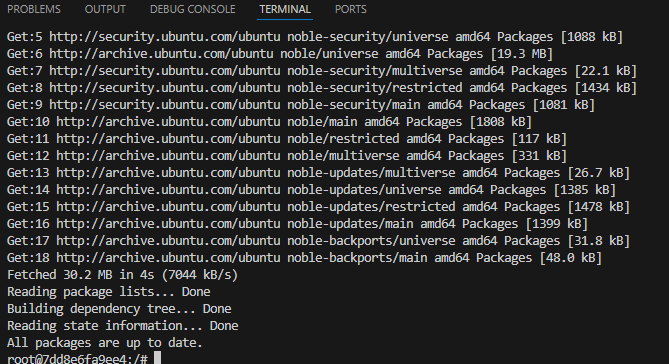

a ultima linha indicando ``ALL packages are up to date.`` indica que as atualizações foram realizadas.

Após isso podemos instalar o ``curl`` com o comando:

```bash
apt install curl -y
```
* ``-y``: Responde automaticamente "sim" a quaisquer prompts de confirmação necessários na instalação.

Após a conclusão da instalação, o ``curl`` estará disponível ddentro do container. O ideal é verificar a instalação com o comando:
```bash
curl --version
```
* ``--version``: Verifica a existência do pacote instalado e sua versão.

O resultado confirmando a instalação é o seguinte:

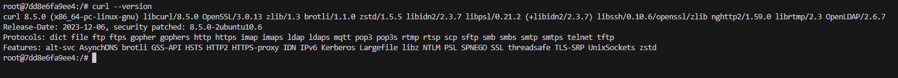

Com isso finaliza a realização do exercício proposto.

---

### 4. Suba um container do MySQL (pode usar a imagem mysql:5.7), utilizando um volume nomeado para armazenar os dados. Crie um banco de dados, pare o container, suba novamente e verifique se os dados persistem.

## 4.1 Subir o Container MySQL com um volume nomeado
* Criando um volume nomeado: pesquisando descobri que ``volumes nomeados`` são a forma preferencial de persistir dados no ``Docker``, porque são gerenciados pelo mesmo e são faceis de se fazer backup e migrar.
O comando utilizado foi:
```bash
docker volume create mysql_data_volume
```
isso criou um volume chamado ``mysql_data_volume``

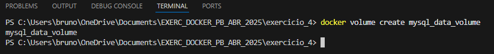

* O próximo passo foi iniciar o Cainter MySQL, montando o volume nomeado e definindo uma senha para o usuário ``root``:
```bash
docker run -d `
  --name meu_mysql_bd `
  -p 3306:3306 `
  -e MYSQL_ROOT_PASSWORD=minhasenha `
  -v mysql_data_volume:/var/lib/mysql `
  mysql:5.7
```
* ``-d``: executa o container em segundo plano.
* ``--name meu_mysql_bd``: atribui um nome  ao container.
* ``-p 3306:3306``: mapeia a porta 3306 do host para a porta 3006 do container.
* ``-e MYSQL_ROOT_PASSWORD=minhasenha``: define a senha do usuário ``root`` do MySQL(O ideal seria substituir o campo ``minhasenha`` por uma senha forte, mas como é somente um exercício deixei assim para facilitar.)
* ``-v mysql_data_volume:/var/lib/mysql``: monta o volume nomeado ``mysql_data_volume`` dentro do diretório ``/var/lib/mysql`` dentro do container, aonde o MySQL armazena seus dados.
* ``mysql:5.7`` indica a imagen MySQL a ser utilizada pelo docker.

após isso verifiquei se a imagem estava criada com o comando:
```bash
docker images
```
e pude verificar q estava criada com a versão correta:

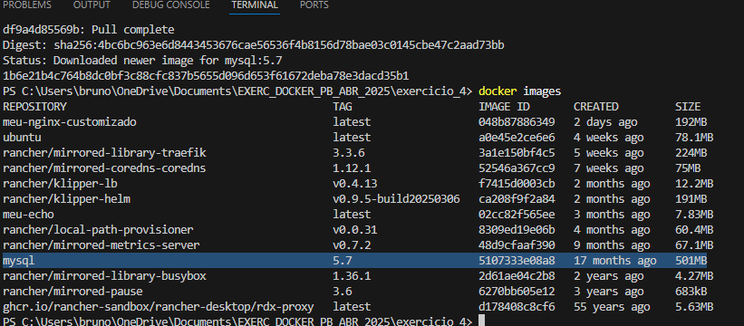

## 4.2 acessando o MySQL e criando um Banco de Dados

* primeiro usei o cliente ``mysql`` que veio junto com a imagem do container
```bash
docker exec -it meu_mysql_bd mysql -u root -p
```
* ``docker exec -it meu_mysql_bd``:abre um terminal interativo no container ``meu_sql_bd``.
* ``mysql -u root -p``: executa o cliente MySQL com o usuário ``root`` e solicita senha, no caso usei a senha ``minhasenha`` que eu tinha mencionado anterioromente.

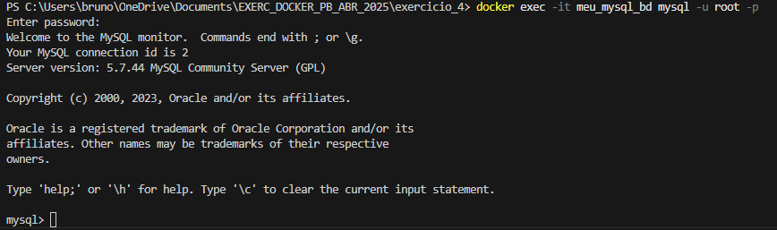

* Após isso foi criar um banco de dados dentro do prompt MySQL:
```SQL
CREATE DATABASE meu_banco_de_dados;
```
E verifiquei se o banco de dados foi realmente criado
```SQL
SHOW DATABASES;
```

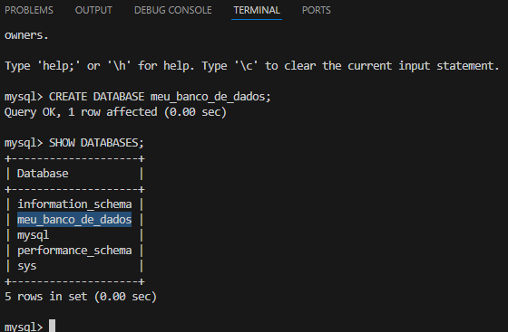

Com o ``meu_banco_de_dados`` criado, foi só sair do cliente MySQL com o comando:
```SQL
exit;
```
## 4.3 parando o container
* Aqui utilizei  a linha de código para parar o container MySQL:
```Bash
docker stop meu_mysql_bd
```
Isso parou o container, mas o volume nomeado ``mysql_data_volume`` e os dados dentro dele vão permanecer.

* Verifiquei se o container foi realmente parado com o comando:
```Bash
docker ps -a
```

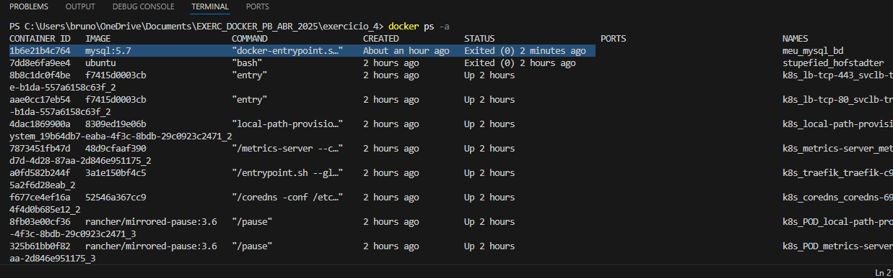

Ele está lá listado como ``Exited``, o que diz que foi parado.

## 4.4 subindo o container de novo e verificando a persistencia dos dados

* iniciei novamente o container MySQL:
```Bash
docker start meu_mysql_bd
```

Como o volume já tinha sido nomeado pude chamar direto pelo seu nome.

* acessei o terminal do MySQL de novo:
```Bash
docker exec -it meu_mysql_bd mysql -u root -p
```

* dentro do prompt MySQL verifiquei se o banco de dados criado ainda existia:
```SQL
SHOW DATABASES;
```

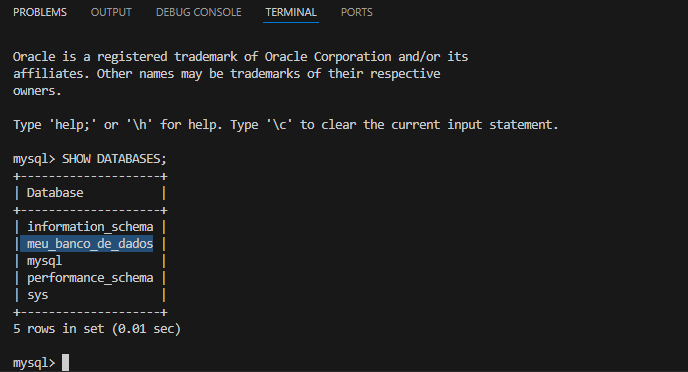

Com isso deu pra constatar a persistencia do Banco de dados no container!

---

### 5. Crie um container com a imagem alpine passando uma variável de ambiente chamada MEU_NOME com seu nome. Execute o container e imprima o valor da variável com o comando echo.

## 5.1 Criando o Dockerfile.
Utilizei os seguintes parâmetros dentro do ``Dockerfile``:
```Dockerfile
FROM alpine:3.21.3

ENV MEU_NOME="Bruno Duarte"

CMD ["sh", "-c", "echo Olá, $MEU_NOME!"]
```
* ``ENV``
: Define uma variável de ambiente padrão.
## 5.2 Construindo a imagem Docker:
* No terminal estando no mesmo diretório que eu salvei o ``Dockerfile`` utilizei a seguinte linha de código:
```Bash
docker build -t alpine-diz-nome .
```
* Em seguinda rodei um comando para verificar se a imagem foi criada:
```Bash
docker images
```
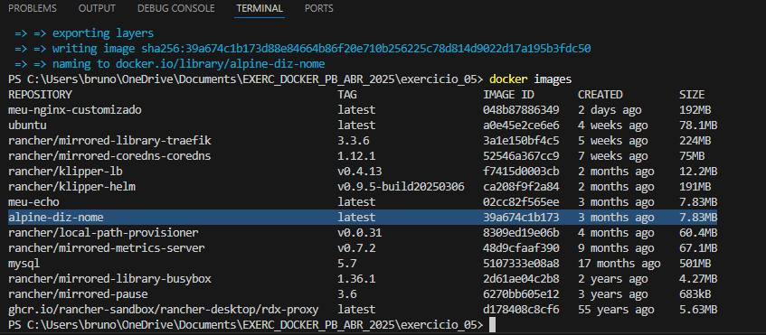

## 5.3 Executando o container

* Utilizei o comando:
```Bash
docker run --rm alpine-diz-nome
```
E observei se o resultado era o esperado:

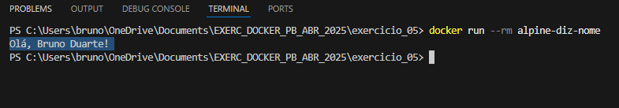

Tudo certo como esperado!

---
### 6. Utilize um multi-stage build para otimizar uma aplicação Go, reduzindo o tamanho da imagem final. Utilize para praticar o projeto [GS PING](https://github.com/docker/docker-gs-ping) desenvolvido em Golang.

## 6.1 Clonando o repositório
* Fiz um ``git clone`` para clonar o repositório em questão:

```Bash
git clone https://github.com/docker/docker-gs-ping.git
```

Dentro do diretório em questão já havia um ``Dockerfile`` que estava da seguinte forma:

```Dockerfile
# syntax=docker/dockerfile:1

FROM golang:1.19

# Set destination for COPY
WORKDIR /app

# Download Go modules
COPY go.mod go.sum ./
RUN go mod download

# Copy the source code. Note the slash at the end, as explained in
# https://docs.docker.com/engine/reference/builder/#copy
COPY *.go ./

# Build
RUN CGO_ENABLED=0 GOOS=linux go build -o /docker-gs-ping

# To bind to a TCP port, runtime parameters must be supplied to the docker command.
# But we can (optionally) document in the Dockerfile what ports
# the application is going to listen on by default.
# https://docs.docker.com/engine/reference/builder/#expose
EXPOSE 8080

# Run
CMD [ "/docker-gs-ping" ]

```

## 6.2 Alterando o dockerfile

* Fiz algumas alterações no ``Dockerfile`` para ficar desta forma, e renomeei o antigo para ``dockerfileOLD``:

```Dockerfile
FROM golang:1.22 AS builder

WORKDIR /app

COPY go.mod go.sum ./

RUN go mod download

COPY . .

RUN CGO_ENABLED=0 go build -o ping ./...

FROM scratch

WORKDIR /app

COPY --from=builder /app/ping .

EXPOSE 8080

ENTRYPOINT ["./ping"]
```

* ``FROM golang:1.22 AS builder`` :Usa uma imagem ``Go`` de um tamanho suficiente para poder compilar a aplicação
* ``WORKDIR`` :Define o diretório de trabalho dentro do container.
* ``RUN go mod download`` :Baixa as dependências do ``Go``.
* ``RUN CGO_ENABLED=0 go build -o ping ./...`` : Constroi o executável e cria um binário estaticamente linkado, sem dependências externas do ``C``. O ``-o ping`` define o nome do executável final como "ping". O ``./...`` compila todos os pacotes ``Go`` no diretório atual e subidiretórios.
* ``FROM scratch`` : ``scratch`` é a imagem mais básica que não contém nada além do kernel do ``Linux``.
* ``COPY --from=builder /app/ping .`` : Copia o executável ``ping`` do estágio ``builder`` para o estágio final.
* ``EXPOSE 8080`` : Expõe a porta que a aplicação ``Go`` vai usar, em padrão.
* ``ENTRYPOINT ["./ping"]`` : Define o comando que será executado quando o container iniciar.

## 6.3 Construindo a imagem no docker

* utilizei o seguinte comando para contrução da imagem:
```Bash
docker build -t go-ping-otimizado .
```

* Após a construção da imagem utilizei para verificar o tamanho da imagem o seguinte comando:

```Bash
docker images go-ping-otimizado
```
* O resultado foi uma imagem com menos de ``10MB`` :
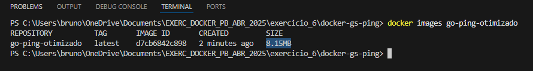

## 6.3 Executando o container da aplicação otimizada
* Para executar o container utilizei o seguinte código:
```Bash
docker run -p 8080:8080 --name ping-app go-ping-otimizado
```
* Após a execução foi só abrir o navegador em http://localhost:8080 e conferir se estava tudo correto:

    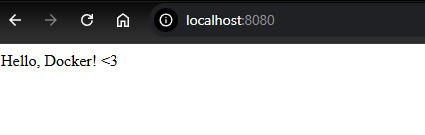

Tudo certo!

---

### 7. Crie uma rede Docker personalizada e faça dois containers, um Node.js e um MongoDB, se comunicarem, sugestão, utilize o projeto React Express + Mongo

## 7.1 Clonando o projeto base

* A primeira coisa que fiz foi clonar o repositório base e acessar a pasta específica do projeto com os comandos:

```Bash
git clone https://github.com/docker/awesome-compose.git
cd awesome-compose/react-express-mongodb
```

## 7.2 Analisando o "docker compose"

* Dentro da pasta já havia um ``docker-compose.yml`` e ele estava assim:

```YAML
version: '3.8'

services:
  backend:
    build: ./backend
    ports:
      - "3001:3001"
    environment:
      MONGO_URI: mongodb://database:27017/mydatabase 
    depends_on:
      - database
  frontend:
    build: ./frontend
    ports:
      - "3000:3000"
    depends_on:
      - backend
  database:
    image: mongo:latest
    ports:
      - "27017:27017"
    volumes:
      - mongodb_data:/data/db

volumes:
  mongodb_data:
```

* Estudando um pouco, entendi que o ``Docker Compose`` já cria uma rede padrão para todos os serviços. Mas também descobri que uma boa prática para clareza e controle é adicionar uma rede Explícita.

## 7.3 Adicionando a Rede Explícita ao "docker compose"
* O primeiro passo foi renomear o antigo arquivo para ``compose.OLD.
* Após isso criar um novo ``docker-compose.yml`` adicionando algumas informações :

```YAML
version: '3.8'

services:
  backend:
    build: ./backend
    ports:
      - "3001:3001"
    environment:
      MONGO_URI: mongodb://database:27017/mydatabase 
    depends_on:
      - database
    networks:
      - app_network 

  frontend:
    build: ./frontend
    ports:
      - "3000:3000"
    depends_on:
      - backend
    networks:
      - app_network 

  database:
    image: mongo:latest
    ports:
      - "27017:27017"
    volumes:
      - mongodb_data:/data/db
    networks:
      - app_network 

volumes:
  mongodb_data:

networks:
  app_network: 
    driver: bridge
    name: minha_rede_customizada 
```

* Eu adcionei uma seção ``networks:`` ao final, definindo ``app_network`` como uma rede do tipo ``bridge`` e dei um nome para ela. Além disso adicionei em cada serviço a diretiva ``networks:`` apontando para o ``app_network``.

## 7.4 Construindo e subindo os containers
* Utilizei a seguinte linha de comando para subir os containers:
```Bash
docker-compose up --build
```
* ``up`` :Cria e inicia os containers.
* ``--build`` : Faz com que as imagens que vem do ``frontend`` e ``backend`` sejam reconstruiídas caso haja alguma alteração.

## 7.5 Verificando a rede criada

* Para verificar a rede criada utilizei o comando:
```Bash
docker network ls
```
E ela estava lá:

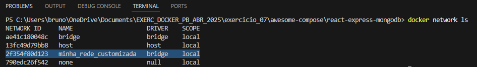

* Para inspecionar a rede eu utilizei o seguinte comando:

```Bash
docker network inspect minha_rede_customizada
```
* Com isso consigo ver uma seção containers que contem os serviços conectados a rede.

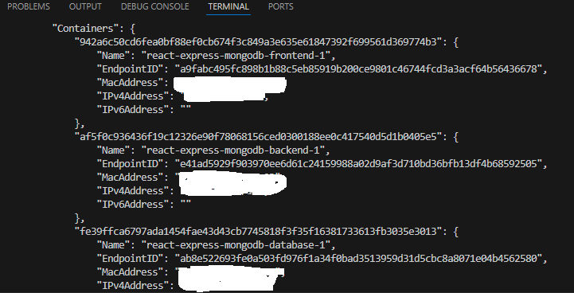

* Após isso foi só entrar no http://localhost:3000/ e testar a applicação:
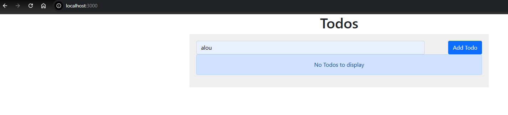

Tudo certo!

---

### 8. Utilize Docker Compose para configurar uma aplicação com um banco de dados PostgreSQL, use para isso o projeto https://github.com/docker/awesome-compose/tree/master/postgresql-pgadmin

## 8.1 Clonando o repositório

* Primeiro passo foi clonar o repositório e ir para a pasta destino:

```Bash
git clone https://github.com/docker/awesome-compose.git
cd awesome-compose/postgresql-pgadmin
```

## 8.2 Analisando o compose.yaml

* O arquivo compose.yml está dessa forma

```YAML
services:
  postgres:
    container_name: postgres
    image: postgres:latest
    environment:
      - POSTGRES_USER=${POSTGRES_USER}
      - POSTGRES_PASSWORD=${POSTGRES_PW}
      - POSTGRES_DB=${POSTGRES_DB} #optional (specify default database instead of $POSTGRES_DB)
    ports:
      - "5432:5432"
    restart: always

  pgadmin:
    container_name: pgadmin
    image: dpage/pgadmin4:latest
    environment:
      - PGADMIN_DEFAULT_EMAIL=${PGADMIN_MAIL}
      - PGADMIN_DEFAULT_PASSWORD=${PGADMIN_PW}
    ports:
      - "5050:80"
    restart: always
```

* o arquivo está usando ``$VARIAVEIS_DE_AMBIENTE``, ao invés de usar valor fixos, com isso o ``Docker Compose`` procura automaticamente um arquivo ``.env`` no mesmo diretório, para poder carregar essa variáveis.

## 8.3 Verificando e modificando o arquivo ".env"

* O arquivo ``.env`` veioo dessa forma
```Snippet
POSTGRES_USER=yourUser
POSTGRES_PW=changeit
POSTGRES_DB=postgres
PGADMIN_MAIL=your@email.com
PGADMIN_PW=changeit
```
* preenchi com dados aleatórios por estar somente em ambiente de teste, mas o ideal em ambiente profissional é usar ``senhas fortes`` e ``e-mails`` que você realmente usa


## 8.4 Incrementando o compose com volume para persistencia de dados

* Adicionei algumas linhas ao código do ``compose.yml`` para criar uum volume e adicionar persistencia de dados ao PostgreSQL:

```YAML
services:
  postgres:
    container_name: postgres
    image: postgres:latest
    environment:
      - POSTGRES_USER=${POSTGRES_USER}
      - POSTGRES_PASSWORD=${POSTGRES_PW}
      - POSTGRES_DB=${POSTGRES_DB}
    ports:
      - "5432:5432"
    restart: always
    volumes: # <-- 
      - db_data:/var/lib/postgresql/data # <-- 

  pgadmin:
    container_name: pgadmin
    image: dpage/pgadmin4:latest
    environment:
      - PGADMIN_DEFAULT_EMAIL=${PGADMIN_MAIL}
      - PGADMIN_DEFAULT_PASSWORD=${PGADMIN_PW}
    ports:
      - "5050:80"
    restart: always
    
    depends_on:
      - postgres # <--

volumes: # <-- 
  db_data: # <-- 
```
* também foi adicionado um ``depends_on`` para garantir que o pgAdmin se conecte ao nome do serviço ``postgres``

## 8.5 Construindo e subindo os containers

* Para subir os containers utilizei a linha de comando:

```BASH
docker-compose up -d
```

## 8.6 acessando o pgAdmin:

Após os containers subirem, abri o navegador e entrei no http://localhost:5050 o que deu pra essa tela:

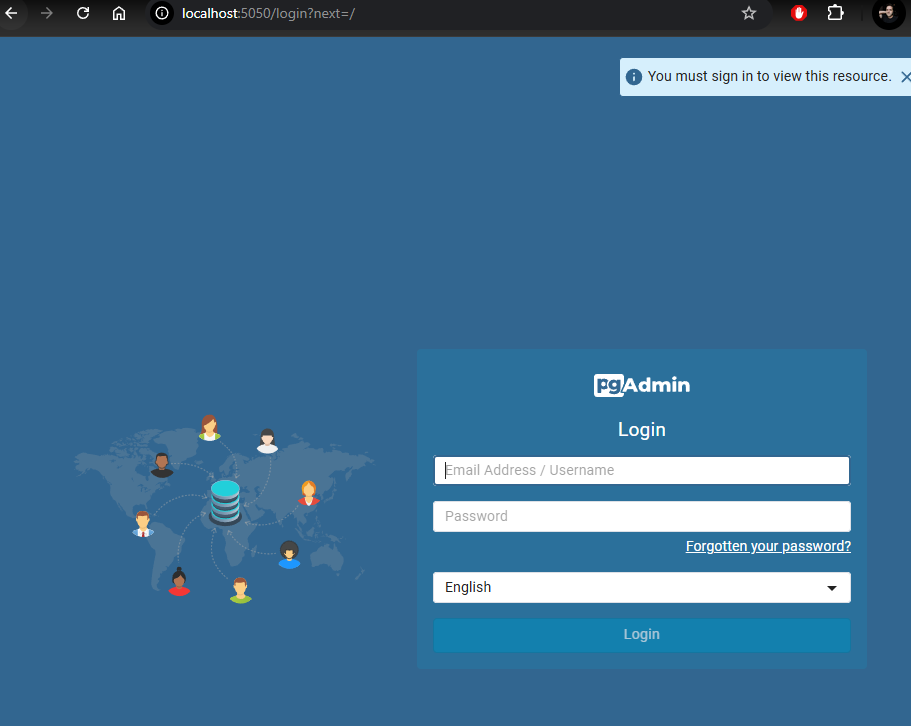

* Após entrar com as credenciais que foram modificadas no ``.env`` nos levou pra essa tela aqui:

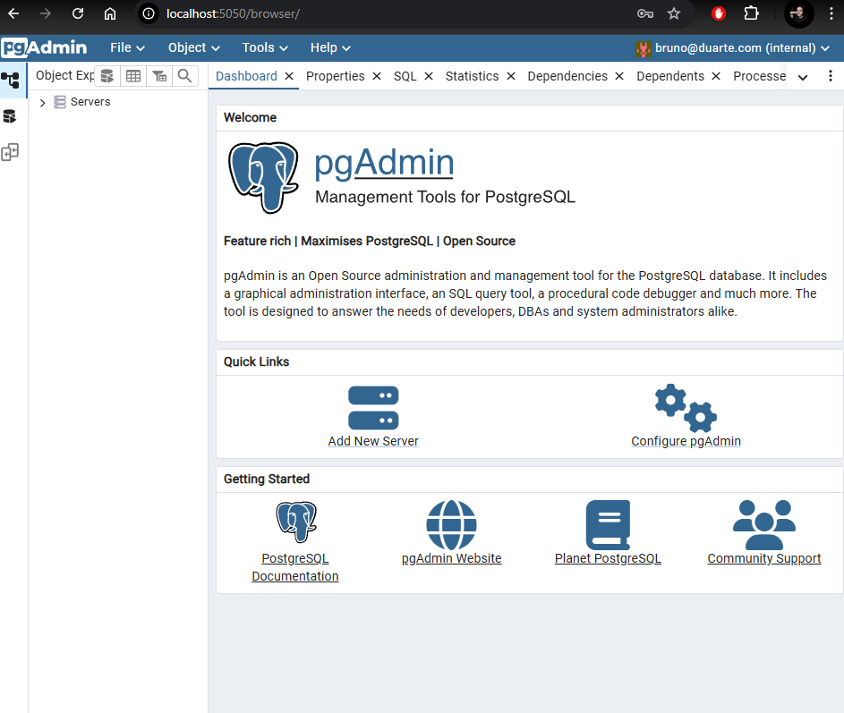

## 8.7 Conectando o pgAdmin ao Banco de Dados PostgreSQL:

* o primeiro passo foi clicar na opção ``Add New Server`` e colocar na aba General um nome para um novo banco de dados:

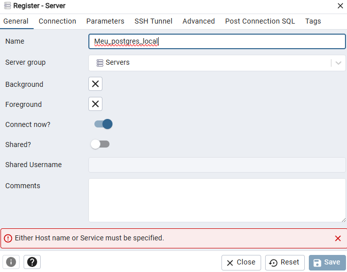

* logo em seguida cliquei na aba ``Conection`` e coloquei o o ``host name`` como ``postgres`` que é o nome que está no ``compose.yml``.
  * ``Host name`` : postgres
  * ``Port`` : 5432 que é a porta padrão do PostgreSQL
  * ``Username`` : o modificado no ``.env``
  * ``Password`` : o modificdao também no ``.env``

Ficou assim:

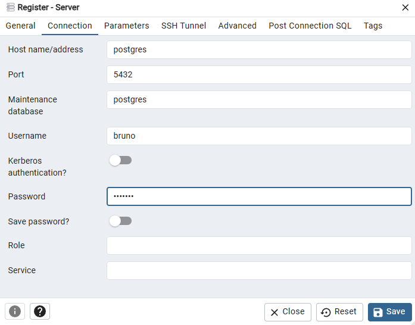

## Com a conexão bem sucedida foi só conferir se o banco de dados tinha sido criado

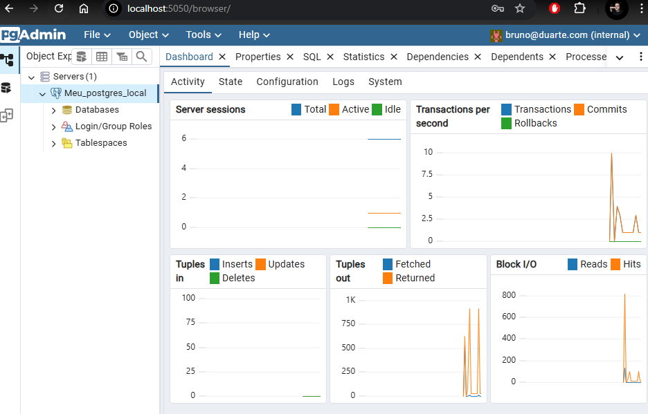

Tudo certo!

---